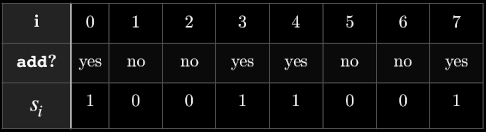
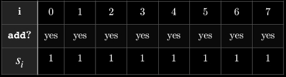
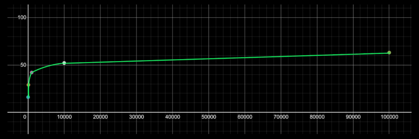

# Secure Elliptic Curve Point Multiplication

## Background

Adverserial analysis of underlying circuitry can reveal information travelling through the hardware. The naive double-and-add point multiplication algorithm offers logarithmic resource consumption, but directly reveals the scalar (used as a cryptographic secret key) during execution: 

```java

while (idx >= 0) {
    result = result.add(result);
    if (theS.testBit(idx--)) {
        result = result.add(this);
    } // else branch utilization can be detected easily in hardware
}
```
Double and add directly reveals secret key by subtleties in circuit operation:



We implement a Montgomery Ladder point multiplication algorithm which executes a constant number of operations regardless of the scalar value:

```rust

  let mut r1 = point;
  let mut r0 = get_e521_id_point();
  for i in (0..=s.bits()).rev()  {
      if s.bit(i) {
          r0 = add_points(&r0, &r1);
          r1 = add_points(&r1, &r1);
      } else { 
          r1 = add_points(&r0, &r1);
          r0 = add_points(&r0, &r0);
      }
  } r0
```
A fixed number of operations occurs regardless of scalar value, preventing adverserial branch analysis:


A logarithmic runtime is achieved over a naive repeated addition approach: (ms vs. value of scalar)


## Technologies:
* The Edwards 521 (E521) curve is used in this work. This curve lends itself towards simpler initialization and greater runtime efficiency. For given use cases, E521 represents the state-of-the-art in elliptic curve technologies. 

